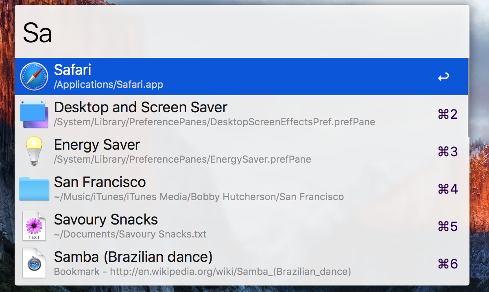
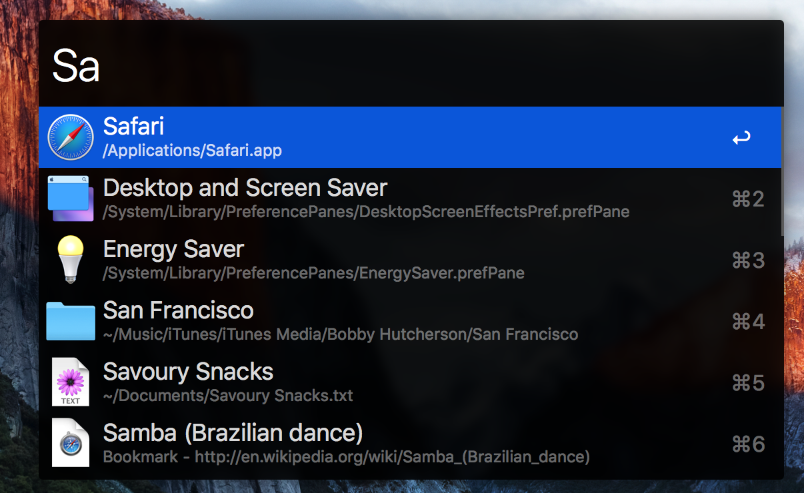
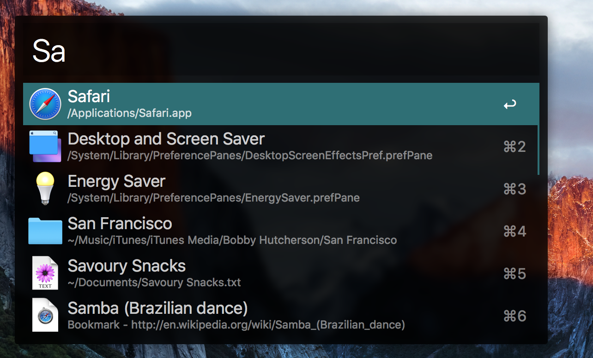
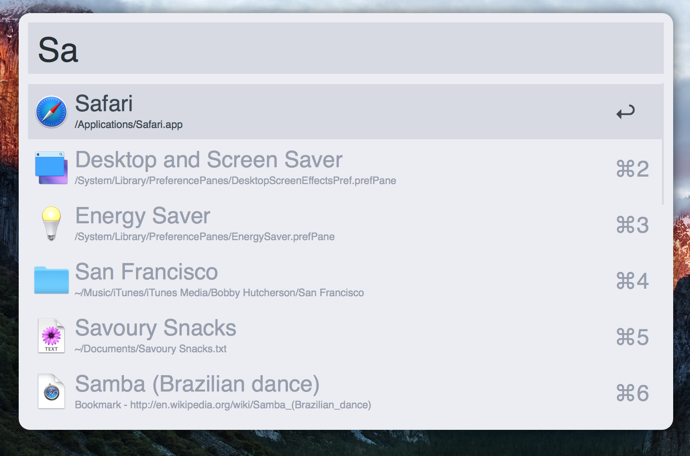
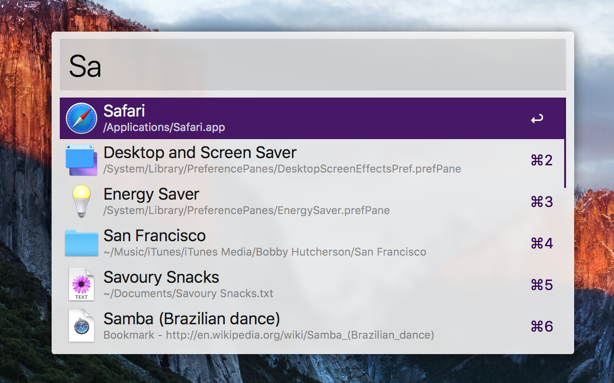

# WoxAlfredTheme
[Alfred](https://www.alfredapp.com) is a powerful productive app for macOS. When I use Windows, I hope to find a substitute, I googled a lot, finally, I chose [Wox](http://www.wox.one) as a substitute. Wox is an open source project that uses **Everything** as backend search service, also supports custom plugins. If you are familiar with Alfred and use Windows too, you should try Wox.

Maybe I am just getting used to Alfred, so I really want to make Wox looks more like Alfred :)

These Wox themes are inspired by following Alfred themes:

## How to use
Download this project, and copy **xaml** files to Wox Theme directory. Wox's data directory usually in `C:\Users\yourusername\AppData\Local\Wox`, go to this folder, you'll find a folder that starts with `app-`, copy **xaml** files into `Themes` folder under `app-`, that's all. Then you can open Wox setting, and you'll see these Alfred themes. Enjoy it.

> P.S: AppData is a hidden folder in the system, if you can not find it, just press `Win + R` and input `%AppData%\..\Local\Wox`, you'll be there.

## Troubleshooting
I've tested these themes with Wox v1.3.524, which is the latest release. If these themes do not work, try to upgrade your Wox to the latest release.
